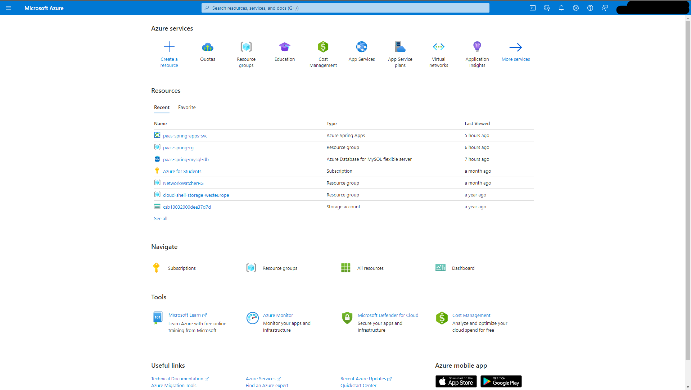
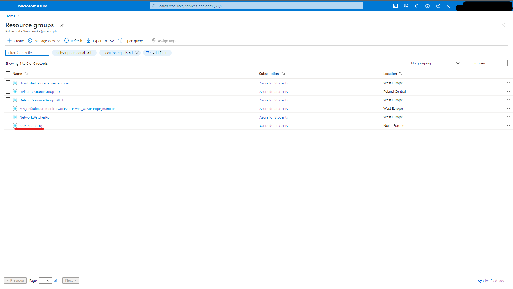
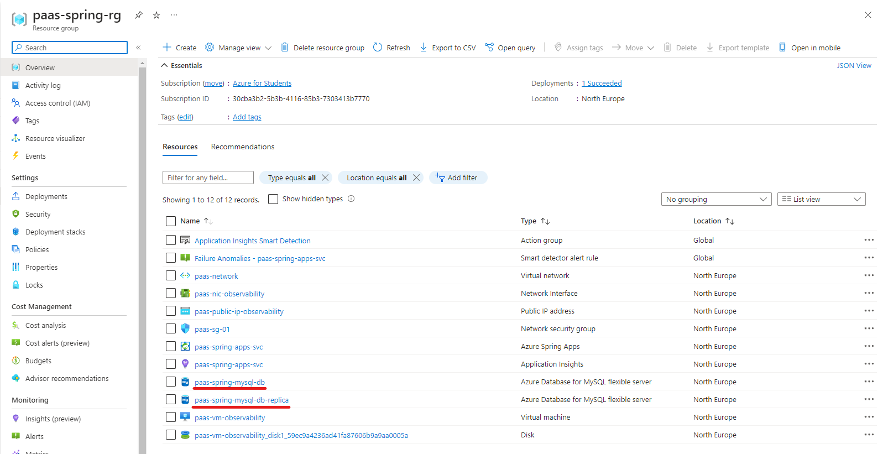
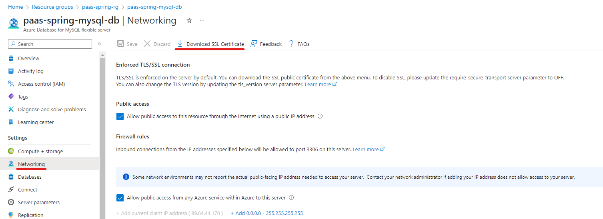
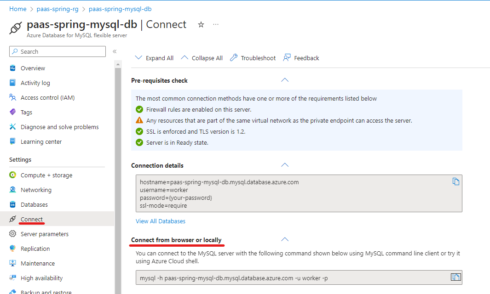

# Platform as a Service

## About

## User guide

!!! Note  
    Please note that before going any further we need to have [Azure CLI](https://learn.microsoft.com/en-us/cli/azure/install-azure-cli) installed. Apart from that we need to be logged into the Azure account in our console by running:  
    ```shell
    az login
    ```
    This will redirect us to a browser to confirm the identity.

### How to create a 1-1 model?
Let's assume that we start in the root directory of the project. In order to create a model go to the `src/main/IaC/PaaS` directory:  
```shell
cd src/main/IaC/PaaS
```
Now we need to configure the environment variables. To do this we need to edit the `variables.sh` file which look like this:  
```bash
#!/bin/sh

export RESOURCE_GROUP_NAME=
export RESOURCE_GROUP_LOCATION=
export MYSQL_ADMIN_USER=
export MYSQL_ADMIN_PASSWORD=
export MYSQL_REPLICATION_USER=
export MYSQL_REPLICATION_PASSWORD=
export SPRING_APP_REPLICAS_COUNT=
export VM_ADMIN_USERNAME=
export PUBLIC_KEY_PATH=
```
Below is an explanation of each variable:  
- `RESOURCE_GROUP_NAME` - resource group name which will be created and in which all other resources will be created  
- `RESOURCE_GROUP_LOCATION` - Azure region (location) in which resource group should be located. Region names can be checked [here](https://azure.microsoft.com/en-us/explore/global-infrastructure/geographies/#geographies). It is important to choose a region which supports [Azure Spring Apps](https://azure.microsoft.com/en-us/products/spring-apps) because not all of them do. For example `northeurope` or `westeurope` can be chosen, but `polandcentral` is not suitable in this case.  
- `MYSQL_ADMIN_USER` - admin username that will be used to access the database  
- `MYSQL_REPLICATION_PASSWORD` - password for the `MYSQL_ADMIN_USER`  
- `MYSQL_REPLICATION_USER` - username for the replication user. In 1-1 model this variable should remain empty  
- `MYSQL_REPLICATION_PASSWORD` - password for the `MYSQL_REPLICATION_USER`. In 1-1 model this variable should remain empty  
- `SPRING_APP_REPLICAS_COUNT` - number of the server app replicas that should be created. In 1-1 model this variable should be set to `1`  
- `VM_ADMIN_USERNAME` - admin username that will be used to access the observability VM  
- `PUBLIC_KEY_PATH` - path to the public key created for the `VM_ADMIN_USERNAME` to access the observability VM. It is suggested to use following command to generate the ssh key pair: `ssh-keygen -t rsa`. For more information about the ssh keys you can read [this article](https://cloud.ibm.com/docs/power-iaas?topic=power-iaas-creating-ssh-key).  
  
To sum up all the above our `variables.sh` file for 1-1 model should look like this:  
```bash
#!/bin/sh

export RESOURCE_GROUP_NAME=paas-spring-rg
export RESOURCE_GROUP_LOCATION=northeurope
export MYSQL_ADMIN_USER=worker
export MYSQL_ADMIN_PASSWORD=wo^Ker_123
export MYSQL_REPLICATION_USER=
export MYSQL_REPLICATION_PASSWORD=
export SPRING_APP_REPLICAS_COUNT=1
export VM_ADMIN_USERNAME=adminuser
export PUBLIC_KEY_PATH=~/.ssh/azure_test-01-rg_key.pub
```
Now we can run `deploy.sh` script to create the test environment:  
```shell
./deploy.sh
```
When the script finishes its execution we should see confirmation that our resources have been created successfully:
```shell
Cloud resources creations has finished
Name                    Location     ResourceGroup    Public Url                                                                 Production Deployment    Provisioning State    CPU    Memory    Running Instance    Registered Instance
    Persistent Storage    Bind Service Registry    Bind Application Configuration Service
----------------------  -----------  ---------------  -------------------------------------------------------------------------  -----------------------  --------------------  -----  --------  ------------------  -------------------
--  --------------------  -----------------------  ----------------------------------------
paas-spring-server-app  northeurope  paas-spring-rg   https://paas-spring-apps-svc-paas-spring-server-app.azuremicroservices.io  default                  Succeeded             1      1Gi       1/1                 0/1
    -                     -                        -
-----------------------------------------------------
-----------------------------------------------------
Deploying observability infrastructure

Terraform used the selected providers to generate the following execution plan. Resource actions are indicated with the following symbols:
  + create

Terraform will perform the following actions:
# terraform logs containing you sensitive information, like ssh-rsa key, Azure subscription ID
Apply complete! Resources: 8 added, 0 changed, 0 destroyed.
```

When the environment is no longer needed we can destroy it by following the steps from [this paragraph](#how-to-clean-up-the-environment)

### How to create a n-1 model?
The steps to create a n-1 model are almost the same as the ones executed previously for 1-1 model.  
The only difference is the value used for `SPRING_APP_REPLICAS_COUNT`. Here we should specify the number of replicas that we want to use, for example `3`.  

!!! Warning  
    The exact number of replicas that you can create may depend on your [subscription type](https://learn.microsoft.com/en-us/microsoft-365/enterprise/subscriptions-licenses-accounts-and-tenants-for-microsoft-cloud-offerings?view=o365-worldwide) and/or your [resource quotas](https://learn.microsoft.com/en-us/azure/quotas/quotas-overview).

An exemplary `variables.sh` file for this scenario is presented below:  
```bash
#!/bin/sh

export RESOURCE_GROUP_NAME=paas-spring-rg
export RESOURCE_GROUP_LOCATION=northeurope
export MYSQL_ADMIN_USER=worker
export MYSQL_ADMIN_PASSWORD=wo^Ker_123
export MYSQL_REPLICATION_USER=
export MYSQL_REPLICATION_PASSWORD=
export SPRING_APP_REPLICAS_COUNT=3
export VM_ADMIN_USERNAME=adminuser
export PUBLIC_KEY_PATH=~/.ssh/azure_test-01-rg_key.pub
```
The command used to create the test environment is the same as previously:  
```shell
./deploy.sh
```

### How to create a master-slave database configuration?
As mentioned in the variables description earlier, we will need to specify values for 2 variables that we've left empty until now:  
- `MYSQL_REPLICATION_USER` - username for the replication user
- `MYSQL_REPLICATION_PASSWORD` - password for the `MYSQL_REPLICATION_USER`
So our `variables.sh` file should look like this:  
```bash
#!/bin/sh

export RESOURCE_GROUP_NAME=paas-spring-rg
export RESOURCE_GROUP_LOCATION=northeurope
export MYSQL_ADMIN_USER=worker
export MYSQL_ADMIN_PASSWORD=wo^Ker_123
export MYSQL_REPLICATION_USER=repl
export MYSQL_REPLICATION_PASSWORD=repl#789
export SPRING_APP_REPLICAS_COUNT=3
export VM_ADMIN_USERNAME=adminuser
export PUBLIC_KEY_PATH=~/.ssh/azure_test-01-rg_key.pub
```
And now we cen deploy the resources:  
```shell
./deploy.sh
```
Unlike previous configuration options, after creating resource we need to do a few things manually.  
Firstly, we need to go to [Azure portal website](https://portal.azure.com/#home). Then we need to select `Resource groups`:  
  
The resource groups can be selected from the `Azure resources` listed below the ribbon, from the list of `Resources` in the middle of the screen or we can search for them in the search bar.  
Then, from the list of resource groups, we need to select our test resource group. If you used the same values as in the example above, you should select `paas-spring-rg`:  

Now we need to open database resources details:   
  
Let's start with the `paas-spring-mysql-db` database. On its page, on the left site we can see `Settings` and `Networking` option underneath. We need to select it, to open networking details:  

Now we need to download the SSL certificate. We will need it in a moment.  
Wwe need to switch to `Connect` option on the left side panel. It is placed below the `Networking` tab that we have used previously:  

On this page we need to copy the code snippet from the `Connect from browser or locally` section and paste it in the terminal:
```shell
mysql -h paas-spring-mysql-db.mysql.database.azure.com -u worker -p
```
When asked for a password, we need to provide the password we have defined in `variables.sh` for the `MYSQL_ADMIN_PASSWORD` variable.  
Now we need to execute:  
```mysql
SHOW MASTER STATUS;
```
Please make sure that you note the result of the query as it will be needed in a moment:  
```mysql
+------------------+----------+--------------+------------------+-------------------+
| File             | Position | Binlog_Do_DB | Binlog_Ignore_DB | Executed_Gtid_Set |
+------------------+----------+--------------+------------------+-------------------+
| mysql-bin.000001 |     1855 |              |                  |                   |
+------------------+----------+--------------+------------------+-------------------+
1 row in set (0.06 sec)

mysql>
```

Let's go back to the resources list and select `paas-spring-mysql-db-replica`. Select `Connect` option on the left side panel, copy the code snippet from the `Connectt from broweser or locally section` and paste it in the terminal:  
```shell
mysql -h paas-spring-mysql-db-replica.mysql.database.azure.com -u worker -p
```
When asked for a password, we need to provide the password we have defined in `variables.sh` for the `MYSQL_ADMIN_PASSWORD` variable.  
Now we need to create the `@cert` variable, which will hold the SSL certificate of the `paas-spring-mysql-db` DB we have downloaded earlier:  
```mysql
SET @cert ='-----BEGIN CERTIFICATE-----
MIIDrzCCApegAwIBAgIQCDvgVpBCRrGhdWrJWZHHSjANBgkqhkiG9w0BAQUFADBh
MQswCQYDVQQGEwJVUzEVMBMGA1UEChMMRGlnaUNlcnQgSW5jMRkwFwYDVQQLExB3
d3cuZGlnaWNlcnQuY29tMSAwHgYDVQQDExdEaWdpQ2VydCBHbG9iYWwgUm9vdCBD
QTAeFw0wNjExMTAwMDAwMDBaFw0zMTExMTAwMDAwMDBaMGExCzAJBgNVBAYTAlVT
MRUwEwYDVQQKEwxEaWdpQ2VydCBJbmMxGTAXBgNVBAsTEHd3dy5kaWdpY2VydC5j
b20xIDAeBgNVBAMTF0RpZ2lDZXJ0IEdsb2JhbCBSb290IENBMIIBIjANBgkqhkiG
9w0BAQEFAAOCAQ8AMIIBCgKCAQEA4jvhEXLeqKTTo1eqUKKPC3eQyaKl7hLOllsB
CSDMAZOnTjC3U/dDxGkAV53ijSLdhwZAAIEJzs4bg7/fzTtxRuLWZscFs3YnFo97
nh6Vfe63SKMI2tavegw5BmV/Sl0fvBf4q77uKNd0f3p4mVmFaG5cIzJLv07A6Fpt
43C/dxC//AH2hdmoRBBYMql1GNXRor5H4idq9Joz+EkIYIvUX7Q6hL+hqkpMfT7P
T19sdl6gSzeRntwi5m3OFBqOasv+zbMUZBfHWymeMr/y7vrTC0LUq7dBMtoM1O/4
gdW7jVg/tRvoSSiicNoxBN33shbyTApOB6jtSj1etX+jkMOvJwIDAQABo2MwYTAO
BgNVHQ8BAf8EBAMCAYYwDwYDVR0TAQH/BAUwAwEB/zAdBgNVHQ4EFgQUA95QNVbR
TLtm8KPiGxvDl7I90VUwHwYDVR0jBBgwFoAUA95QNVbRTLtm8KPiGxvDl7I90VUw
DQYJKoZIhvcNAQEFBQADggEBAMucN6pIExIK+t1EnE9SsPTfrgT1eXkIoyQY/Esr
hMAtudXH/vTBH1jLuG2cenTnmCmrEbXjcKChzUyImZOMkXDiqw8cvpOp/2PV5Adg
06O/nVsJ8dWO41P0jmP6P6fbtGbfYmbW0W5BjfIttep3Sp+dWOIrWcBAI+0tKIJF
PnlUkiaY4IBIqDfv8NZ5YBberOgOzW6sRBc4L0na4UU+Krk2U886UAb3LujEV0ls
YSEY1QSteDwsOoBrp+uvFRTp2InBuThs4pFsiv9kuXclVzDAGySj4dzp30d8tbQk
CAUw7C29C79Fv1C5qfPrmAESrciIxpg0X40KPMbp1ZWVbd4=
-----END CERTIFICATE-----';
```
When everything is ok we will receive response similar to the one presented below:  
```mysql
Query OK, 0 rows affected (0.07 sec)
```

!!! Tip  
    Please make sure that you end every SQL query with a semicolon(`;`).

In order to connect current database to the first one we need to use the command which structure is presented below:  
```mysql
CALL mysql.az_replication_change_master('<master_host>', '<master_user>', '<master_password>', <master_port>, '<master_log_file>', <master_log_pos>, '<master_ssl_ca>');
```
Here is an explanation for the values placeholders:  
- `<master_host>` - represents the name of the first database. In our case this name is `paas-spring-mysql-db.mysql.database.azure.com`
- `<master_user>` - user which will be used to replicate the data from the first database (called master) to the current database (called slave). We have specified the name of this user in the `varaibles.sh` file in the `MYSQL_REPLICATION_USER` variable
- `<master_password>` - password that will be used by the replication user. We have specified this value in the `varaibles.sh` file in the `MYSQL_REPLICATION_PASSWORD` variable
- `<master_port>` - MySQL Database default connection port is `3306` and because we haven't changed it, we can use it here
- `<master_log_file>` - name of the file use for logging that we have checked earlier. This is the value present in the `File` column we have received when we have checked the master status on the first database.
- `<master_log_pos>` - position in binary log that we have checked earlier. This is the value present in the `Position` column we have received when we have checked the master status on the first database.
To sum up all the above our query looks like this:  
```mysql
CALL mysql.az_replication_change_master('paas-spring-mysql-db.mysql.database.azure.com', 'repl', 'repl#789', 3306, 'mysql-bin.000001', 1855, @cert);
```
And we expect following output for our command:  
```mysql
+--------------------------------------------------------------------------------------------------+
| message                                                                                          |
+--------------------------------------------------------------------------------------------------+
| Successfully change the master. Please run "show slave status;" to check the replication status. |
+--------------------------------------------------------------------------------------------------+
1 row in set (3.45 sec)

Query OK, 0 rows affected (3.45 sec)

mysql>
```
Now we can start the replication by running the command:  
```mysql
CALL mysql.az_replication_start;
```
The output for this command should look like this:  
```mysql
+------------------------------------------------------------------------------------------------------+
| message                                                                                              |
+------------------------------------------------------------------------------------------------------+
| Successfully start the replication. Please run "show slave status;" to check the replication status. |
+------------------------------------------------------------------------------------------------------+
1 row in set (0.07 sec)

Query OK, 0 rows affected (0.07 sec)

mysql>
```
Everything looks fine, so our database should be ready to serve as a slave database. We can additionally check its status to assure that there isn't any error by running:  
```mysql
SHOW SLAVE STATUS;
```
The output to this command is quite complex, so we should look for the following sentence:  
```
Replica has read all relay log; waiting for more updates
```
Which means that every thing is alright. If we found some `error` keyword in the output, then there might be a problem with the database connectivity.  
Once everything is set up we can try to add a new value to the first database. To do this we need to select the `cache` database:  
```mysql
USE CACHE;
```
And we expect following output:  
```mysql
Reading table information for completion of table and column names
You can turn off this feature to get a quicker startup with -A

Database changed
```
Now we can run the `INSERT` statement:  
```mysql
INSERT into factorization_results VALUES (17, '[1, 17]');
```
And we expect following output:  
```mysql
Query OK, 1 row affected (0.06 sec)
```
Now, let's check that the can see the value inside the `factorization_results` table:  
```mysql
SELECT * FROM factorization_results;
```
And the result is:  
```mysql
+--------+---------+
| number | factors |
+--------+---------+
|     17 | [1, 17] |
+--------+---------+
1 row in set (0.07 sec)
```
We can move on to the slave database to check the data stored there. Again, we need to select the database and query the table:  
```mysql
mysql> USE CACHE;
Reading table information for completion of table and column names
You can turn off this feature to get a quicker startup with -A

Database changed
mysql> SELECT * FROM factorization_results;
+--------+---------+
| number | factors |
+--------+---------+
|     17 | [1, 17] |
+--------+---------+
1 row in set (0.06 sec)

mysql>
```
If the tables content match, then everything has been configured correctly.  
If you need more information about connecting the slave database to master database, please refer to these 2 articles:  
- [How to configure Azure Database for MySQL - Flexible Server data-in replication](https://learn.microsoft.com/en-us/azure/mysql/flexible-server/how-to-data-in-replication?tabs=bash%2Ccommand-line#configure-the-source-mysql-server)  
- [MySQL Configuring Replication](https://dev.mysql.com/doc/refman/5.7/en/replication-configuration.html)

### How to clean up the environment?
When the test environment is no longer needed we can run `destroy.sh` script to clean up the environment:
```shell
./destroy.sh
```
Here we will be asked twice whether we want to destroy the resources. In order to fully clean the environment (and stop paying for the resources wwe no longer need), we need to accept both messages:  
```shell
...
Plan: 0 to add, 0 to change, 8 to destroy.

Do you really want to destroy all resources?
  Terraform will destroy all your managed infrastructure, as shown above.
  There is no undo. Only 'yes' will be accepted to confirm.

  Enter a value:

...

Destroy complete! Resources: 8 destroyed.
Are you sure you want to perform this operation? (y/n): 
...
```