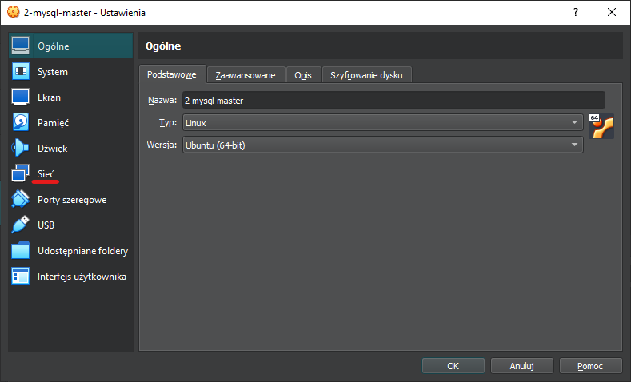
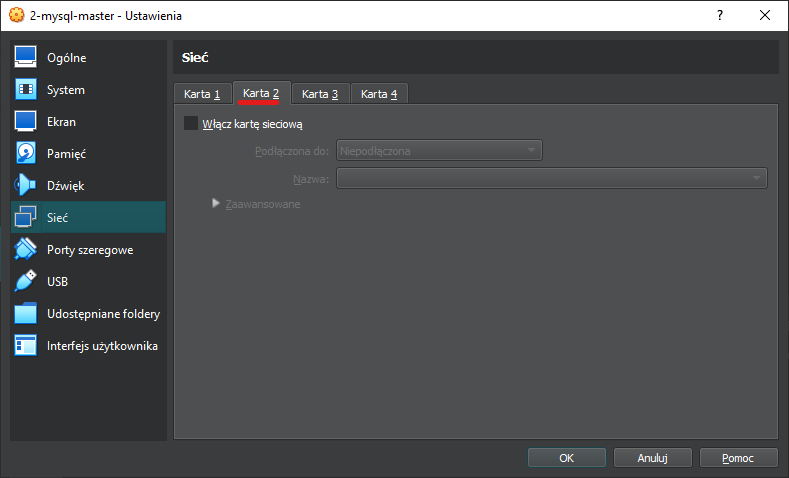
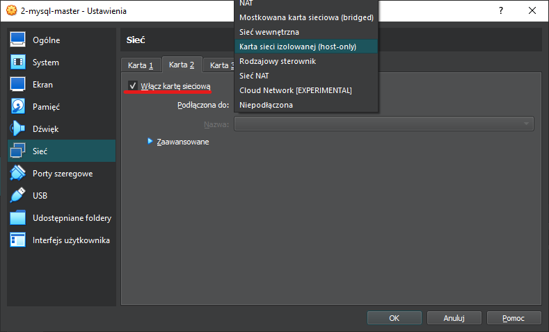
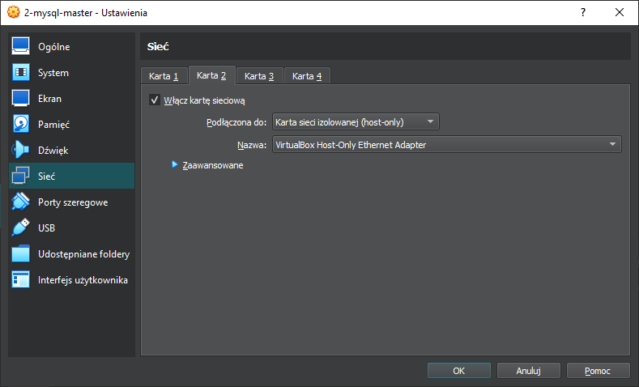
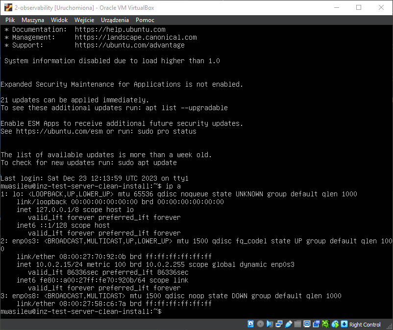
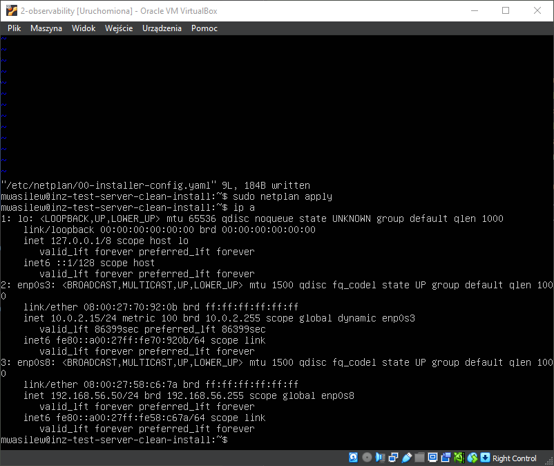
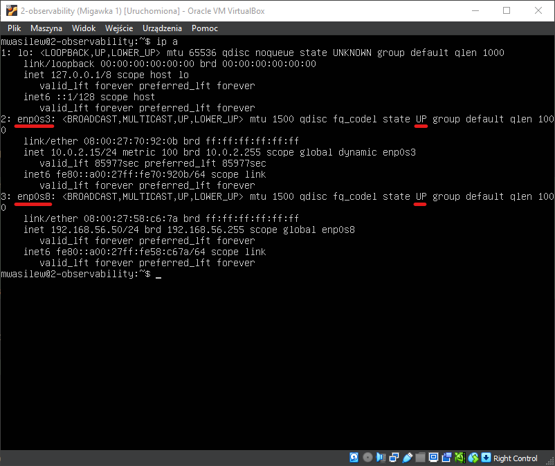

# VirtualBox

## About
This section describes steps required to configure the `on premise` test environment which is set up on virtual machines.  
Solutions provided below might be useful to quickly set up and test the application without the need to access the cloud resources.

## User guide

!!! Note  
    Please note that before going any further we need to have some virtualization tool installed, like `VirtualBox` or `VMWare Wortstation`. In the tutorial below the `VirtualBox` will be used.  
    Additionally, a linux operating system image is needed. In the tutorial below the linux `Ubuntu Server 22.04.3 LTS` will be used. The latest version of the `Ubuntu Server` can be downloaded from [here](https://ubuntu.com/download/server).

!!! Warning
    Before running any script we need to make sure that the line separators of files with extensions `.sh` match our system requirements. Example is provided below:   
    ```
    $ file deploy.sh
    deploy.sh: Bourne-Again shell script, ASCII text executable, with CRLF line terminators
    $ sed -i 's/\r$//' load_variables.sh
    $ file load_variables.sh
    deploy.sh: Bourne-Again shell script, ASCII text executable
    ```
    Alternatively, line separators can be configured in our IDE like in [IntelliJ IDEA](https://www.jetbrains.com/help/idea/configuring-line-endings-and-line-separators.html).

!!! Tip  
    Both `VirtualBox` deployment and [`IaaS`](../IaaS/iaas.md) deployment use virtual machines (VMs); therefore, some tips / instructions may apply to both environments. 

### How to configure networking?
By default, `VirtualBox` add a single network interface to newly created VM - `NAT` (`Network Address Transaltion`) - which allows the VM to communicate with the Internet. If we ony want to test one thing on the VM, then this single network interface can probably be all that we need. However, when we want multiple VMs to communicate with each other, then we need to add another network interface.  
We can choose from several options which are described [here](https://www.virtualbox.org/manual/ch06.html). A table with the most important characteristics is presented below:

| Mode       | VM -> Host | VM <- Host   | VM1 <-> VM2 | VM -> Net/LAN | VM <- Net/LAN |
|------------|------------|--------------|-------------|---------------|---------------|
| Host-only  | +          | +            | +           | -             | -             |
| Internal   | -          | -            | +           | -             | -             |
| Bridged    | +          | +            | +           | +             | +             |
| NAT        | +          | Port forward | -           | +             | Port forward  |
| NATservice | +          | Port forward | +           | +             | Port forward  |

For more information about `Port forward` in `NAT` please refer to [this article](https://www.virtualbox.org/manual/ch06.html#natforward) and for more information about `Port forward` in `NATservice` please refer to [this article](https://www.virtualbox.org/manual/ch06.html#network_nat_service).  
The table above show that the `Bridged` mode can handle all types of communication; however, this type of network interface requires a static IP address in our network, so it might not always be the best option.  
The `Host-only` network interface will be sufficient for this tutorial and according to the documentation provided earlier (and [here](https://www.virtualbox.org/manual/ch06.html)):

!!! Quote
    On Linux, macOS and Solaris Oracle VM VirtualBox will only allow IP addresses in 192.168.56.0/21 range to be assigned to host-only adapters. For IPv6 only link-local addresses are allowed. If other ranges are desired, they can be enabled by creating /etc/vbox/networks.conf and specifying allowed ranges there.

In order to add the second network interface, we can follow the steps from the documentation or from the screenshots below. Buttons clicked in each step are marked with the red underscore:  




Now we need to accept the changes and start our VM. We can check available network interfaces by running the command:  
```shell
ip a
```
And the output should be similar to this one:

We can see that the first network interface (`NAT`) is configured, but the second one (`host-only`) is not. In linux `Ubuntu 22.04` we can change the network interfaces configuration in file `/etc/netplan/00-installer-config.yaml` by running the command:
```shell
sudo vi /etc/netplan/00-installer-config.yaml
```
By default, this file looks like this:  
```shell
# This is the network config written by 'subiquity'
network:
  ethernets:
    enp0s3:
      dhcp4: true
  version: 2
```
We need to add an entry about the second network interface (`enp0s8` is shown on the previous screenshot). We would like to disable the `dhcp4` for this interface and add an IP address, for example `192.168.56.50/24`:
```shell
# This is the network config written by 'subiquity'
network:
  ethernets:
    enp0s3:
      dhcp4: true
    enp0s8:
      dhcp4: false
      addresses: [192.168.56.50/24]
  version: 2
```
Now we need to save changes. To reload the configuration we can type:
```shell
sudo netplan apply
```
And type:
```shell
ip a
```
Once again to check the results. If everything is fine, then we should see and output similar to this one:  

We need to check here that both network interfaces are `UP`:

And we are ready to go.

### How to create a 1-1 model?
Let's assume that we start in the root directory of the project. In order to create a model go to the `src/main/IaC/VirtualBox` directory:
```shell
cd src/main/IaC/VirtualBox
```
Now we need to configure the environment variables. To do this we need to edit the `variables.sh` file which look like this:
```bash
#!/bin/bash

export MYSQL_ADMIN_USER=
export MYSQL_ADMIN_PASSWORD=
export MYSQL_REPLICATION_USER=
export MYSQL_REPLICATION_PASSWORD=
export VM_SERVER_IP=()
export VM_MASTER_DB_IP=
export VM_REPLICA_DB_IP=
export VM_OBSERVABILITY_IP=
export VM_NGINX_IP=
export NGINX_LOAD_BALANCING_STRATEGY=
```
Below is an explanation of each variable:  
- `MYSQL_ADMIN_USER` - admin username that will be used to access the database  
- `MYSQL_REPLICATION_PASSWORD` - password for the `MYSQL_ADMIN_USER`  
- `MYSQL_REPLICATION_USER` - username for the replication user. In 1-1 model this variable should remain empty  
- `MYSQL_REPLICATION_PASSWORD` - password for the `MYSQL_REPLICATION_USER`. In 1-1 model this variable should remain empty  
- `VM_SERVER_IP` - an array of IPs that we have defined for the `host-only` network interfaces in the server VMs  
- `VM_MASTER_DB_IP` - an IP that we have defined for the `host-only` network interface in the DB VM  
- `VM_REPLICA_DB_IP` - an IP that we have defined for the `host-only` network interface in the replica DB VM. In 1-1 model this should remain empty  
- `VM_OBSERVABILITY_IP` - an IP that we have defined for the `host-only` network interface in the observability VM  
- `VM_NGINX_IP` - an IP that we have defined for the `host-only` network interface in the nginx VM  
- `NGINX_LOAD_BALANCING_STRATEGY` - a strategy for load balancing. In 1-1 model it is can be left empty. More on the load balancing strategies can be found [here](#how-to-choose-load-balancing-strategy)  

To sum up all the above our `variables.sh` file for the 1-1 model should look like this:
```shell
#!/bin/bash

export MYSQL_ADMIN_USER=worker
export MYSQL_ADMIN_PASSWORD=wo^Ker_123
export MYSQL_REPLICATION_USER=
export MYSQL_REPLICATION_PASSWORD=
export VM_SERVER_IP=(192.168.56.41)
export VM_MASTER_DB_IP=192.168.56.30
export VM_REPLICA_DB_IP=
export VM_OBSERVABILITY_IP=192.168.56.50
export VM_NGINX_IP=192.168.56.40
export NGINX_LOAD_BALANCING_STRATEGY=
```
Now we can run the `load_variables.sh` script to parametrize the configuration scripts for VMs:
```shell
./load_varaibles.sh
```
And we expect an output similar to this one:
```shell
-----------------------------------------------------
Creating copies of files that need to be changed
-----------------------------------------------------
Reading variables.sh
VM_REPLICA_DB_IP is empty or not set. customdata_db_replica.sh will not be parametrized
NGINX_LOAD_BALANCING_STRATEGY is empty or not set. Proceeding with default strategy "round robin"
-----------------------------------------------------
The files have been parametrized
```

Now our files are parametrized. In order to configure the VMs we need to copy them to the appropriate VMs (`customdata_db.sh` to the DB VM, `customdata_nginx.sh` to the nginx load balancer VM, etc.). We need to make sure that the scripts are executable - command below will allow us to execute the configuration script:  
```shell
chmod +x customdata_db.sh
```
After running configuration script:  
```shell
./customdata_db.sh
```
We might be asked to type password for the root user to authorize the installation.  

!!! Warning
    The order in which we should configure our VMs is presented below:  
    1. VM for the database  
    2. VM for the server app  
    3. VM for observability  
    4. VM for the nginx load balancer  

### How to create a n-1 model?
The steps to create a n-1 model are almost the same as the ones executed previously for the 1-1 model.  
The only difference is the number of IP addresses used for `VM_SERVER_IP` variable. Here we should specify the IPs that we have used to configure the `host-only` network interfaces of the server VMs.  

To sum up all the above our `variables.sh` file for the n-1 model should look like this:
```shell
#!/bin/bash

export MYSQL_ADMIN_USER=worker
export MYSQL_ADMIN_PASSWORD=wo^Ker_123
export MYSQL_REPLICATION_USER=
export MYSQL_REPLICATION_PASSWORD=
export VM_SERVER_IP=(192.168.56.41 192.168.56.42)
export VM_MASTER_DB_IP=192.168.56.30
export VM_REPLICA_DB_IP=
export VM_OBSERVABILITY_IP=192.168.56.50
export VM_NGINX_IP=192.168.56.40
export NGINX_LOAD_BALANCING_STRATEGY=
```
Now we can run the `load_variables.sh` script to parametrize the configuration scripts for VMs:
```shell
./load_varaibles.sh
```
And we expect an output similar to this one:
```shell
-----------------------------------------------------
Creating copies of files that need to be changed     
-----------------------------------------------------
Reading variables.sh
VM_REPLICA_DB_IP is empty or not set. customdata_db_replica.sh will not be parametrized
NGINX_LOAD_BALANCING_STRATEGY is empty or not set. Proceeding with default strategy "round robin"
-----------------------------------------------------
The files have been parametrized 
```

### How to create a master-slave database configuration?
As mentioned in the variables description earlier, we will need to specify values for 3 variables that we've left empty until now:  
- `MYSQL_REPLICATION_USER` - username for the replication user  
- `MYSQL_REPLICATION_PASSWORD` - password for the `MYSQL_REPLICATION_USER`  
- `VM_REPLICA_DB_IP` - an IP that we have defined for the `host-only` network interface in the replica DB VM  
The slave database can be configured for the 1-1 model as well as for the n-1 model; therefore, depending on our choices the `variables.sh` files should look like this for 1-1 model (or actually the 1-2 model, because we are adding a second DB)
```shell
#!/bin/bash

export MYSQL_ADMIN_USER=worker
export MYSQL_ADMIN_PASSWORD=wo^Ker_123
export MYSQL_REPLICATION_USER=repl
export MYSQL_REPLICATION_PASSWORD=Repl#789
export VM_SERVER_IP=(192.168.56.41)
export VM_MASTER_DB_IP=192.168.56.30
export VM_REPLICA_DB_IP=192.168.56.31
export VM_OBSERVABILITY_IP=192.168.56.50
export VM_NGINX_IP=192.168.56.40
export NGINX_LOAD_BALANCING_STRATEGY=
```
Or like this for the n-1 model (or actually n-2, because we are adding a second DB):
```shell
#!/bin/bash

export MYSQL_ADMIN_USER=worker
export MYSQL_ADMIN_PASSWORD=wo^Ker_123
export MYSQL_REPLICATION_USER=repl
export MYSQL_REPLICATION_PASSWORD=Repl#789
export VM_SERVER_IP=(192.168.56.41 192.168.56.42)
export VM_MASTER_DB_IP=192.168.56.30
export VM_REPLICA_DB_IP=192.168.56.31
export VM_OBSERVABILITY_IP=192.168.56.50
export VM_NGINX_IP=192.168.56.40
export NGINX_LOAD_BALANCING_STRATEGY=
```
And we expect an output similar to this one:  
```shell
-----------------------------------------------------
Creating copies of files that need to be changed     
-----------------------------------------------------
Reading variables.sh
NGINX_LOAD_BALANCING_STRATEGY is empty or not set. Proceeding with default strategy "round robin"
-----------------------------------------------------
The files have been parametrized
```

### How to choose load balancing strategy?
#### What load balancing strategies are available?
In nginx there are several options regarding load balancing which are describe [here](https://docs.nginx.com/nginx/admin-guide/load-balancer/http-load-balancer/).  
In this environment we can specify which load balancing strategy do we want to use. Below are quotes describing available strategies:

!!! quote
    `Round Robin` – Requests are distributed evenly across the servers (...). This method is used by default (there is no directive for enabling it).

!!! quote
    `Least Connections` – A request is sent to the server with the least number of active connections (...).

!!! quote
    `IP Hash` – The server to which a request is sent is determined from the client IP address. In this case, either the first three octets of the IPv4 address or the whole IPv6 address are used to calculate the hash value. The method guarantees that requests from the same address get to the same server unless it is not available.

!!! Tip
    Load balancing configuration looks the same as for the `IaaS` deployment so for more information have a look [here](../IaaS/iaas.md#how-to-choose-load-balancing-strategy).

### How to restore original files?
In order to restore original files we can simply use the script `restore_original_files.sh`:  
```shell
./restore_original_files
```
Here we will be asked whether we want to restore the original files:
```shell
Are you sure that you want to restore the original files? (y/n)
```
And after confirming our intention we should see following output:
```shell
-----------------------------------------------------
Restoring original files
-----------------------------------------------------
The files have been restored
```