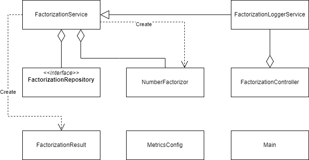

# Test service

## About
Test service is an exemplary service written in `Java` and `Spring Boot`. It is responsible for refactoring the number that it receives in request. The requests should be sent to address:
```shell
<address-at-which-service-is-available>:8080/factorize/<number-to-be-factorized>
```
Due to the fact that factorization of large number is very time-consuming, the range is limited to `[0; 10737418]`, where `10737418` is equal to `Integer.MAX_VALUE / 200` calculated in Java.  
Below the class diagram of the service is presented:
